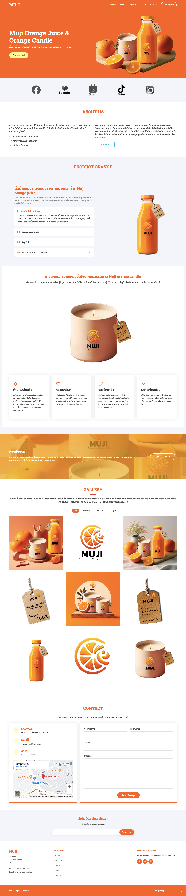

# Present Product Muji Orange juice & Orange candle

It is a product presented in the form of a website. Place for reporting on marketing courses

 - Responsive website 
 - CSS vendor

## Language use

 - HTML
 - CSS : Tailwind Utility Framework 
 - JavaScript : Slick Library, Jquery
 - Fontawsome
 
## Installation

Take this example.
```git
git clone https://github.com/suphawitz/Muji-orangeProduct.git
```

## Template your project


# Creadite template from
    Template Name: Arsha
    Template URL: https://bootstrapmade.com/arsha-free-bootstrap-html-template-corporate/
    Author: BootstrapMade.com
    License: https://bootstrapmade.com/license/

## Thank you for coming to see.


